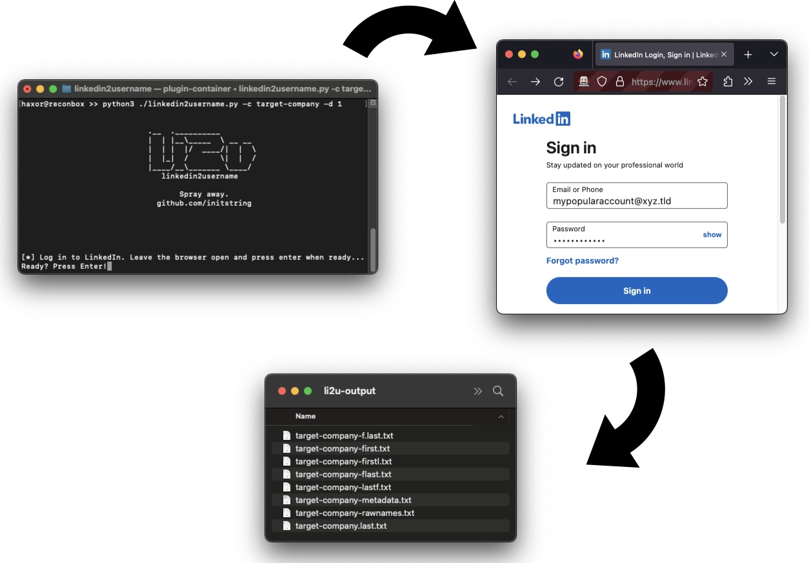

# linkedin2username
OSINT Tool: Generate username lists from companies on LinkedIn.

This is a pure web-scraper, no API key required. You use your valid LinkedIn username and password to login, it will create several lists of possible username formats for all employees of a company you point it at.

Here's what you get:
- first.last.txt: Usernames like Joe.Schmoe
- f.last.txt:     Usernames like J.Schmoe
- flast.txt:      Usernames like JSchmoe
- firstl.txt:     Usernames like JoeS
- first.txt       Usernames like Joe
- lastf.txt       Usernames like SchmoeJ
- rawnames.txt:   Full name like Joe Schmoe
- metadata.txt    CSV file which is full_name,occupation

Optionally, the tool will append @domain.xxx to the usernames.



## Warnings

Do not blame me if your LinkedIn account gets rate limited, or even banned. This is a security research tool - use it only after reading the code and fully understanding what it is doing.

I have not heard of any account bans since the tool was written, but rate limiting does occasionally kick in when the "commercial search limit" is hit. That has been temporary so far (measured monthly).

## Using the tool

### Pre-requisites

Install the Python dependencies with `pip3 install -r ./requirements.txt`.

You'll also need Chrome, Chromium, or Firefox installed in typical paths that can be discovered by Selenium. A web browser will be spawned temporarily to handle the login.

### Full usage
```
usage: linkedin2username.py [-h] -c COMPANY [-n DOMAIN] [-d DEPTH]
  [-s SLEEP] [-x PROXY] [-k KEYWORDS] [-g] [-o OUTPUT]

OSINT tool to generate lists of probable usernames from a given company's LinkedIn page.
This tool may break when LinkedIn changes their site.
Please open issues on GitHub to report any inconsistencies.

optional arguments:
  -h, --help            show this help message and exit
  -c COMPANY, --company COMPANY
                        Company name exactly as typed in the company linkedin profile page URL.
  -n DOMAIN, --domain DOMAIN
                        Append a domain name to username output.
                        [example: "-n targetco.com" would output jschmoe@targetco.com]
  -d DEPTH, --depth DEPTH
                        Search depth (how many loops of 25). If unset, will try to grab them
                        all.
  -s SLEEP, --sleep SLEEP
                        Seconds to sleep between search loops. Defaults to 0.
  -x PROXY, --proxy PROXY
                        Proxy server to use. WARNING: WILL DISABLE SSL VERIFICATION.
                        [example: "-p https://localhost:8080"]
  -k KEYWORDS, --keywords KEYWORDS
                        Filter results by a a list of command separated keywords.
                        Will do a separate loop for each keyword,
                        potentially bypassing the 1,000 record limit. 
                        [example: "-k 'sales,human resources,information technology']
  -g, --geoblast        Attempts to bypass the 1,000 record search limit by running
                        multiple searches split across geographic regions.
  -o OUTPUT, --output OUTPUT
                        Output Directory, defaults to li2u-output
```


### Examples
You'll need to provide the tool with LinkedIn's company name. You can find that by looking at the URL for the company's page. It should look something like `https://linkedin.com/company/targetco`. It may or may not be as simple as the exact name of the company.

Here's an example to pull all employees of targetco:

```
$ python linkedin2username.py -c targetco
```

Here's an example to pull a shorter list and append the domain name @targetco.com to them:

```
$ python linkedin2username.py -c targetco -d 5 -n 'targetco.com'
```

### Tips

Use an account with a lot of connections, otherwise you'll get crappy results. Adding a couple connections at the target company should help - this tool will work up to third degree connections. Note that [LinkedIn will cap search results](https://www.linkedin.com/help/linkedin/answer/129/what-you-get-when-you-search-on-linkedin?lang=en) to 1000 employees max. You can use the features '--geoblast' or '--keywords' to bypass this limit. Look at help below for more details.

## Toubleshooting

When LinkedIn changes things, the tool may break. The API used here is not documented, and it may take some fiddling around to get it working again. Please open issues if you notice something weird.

You can verify Selenium works on your machine like this:

```
$ python3

from selenium import webdriver
driver = webdriver.Firefox() # or webdriver.Chrome()
driver.get("https://linkedin.com/login")
```

You can try the `--proxy` flag to inspect traffic with Burp. Right now, it is not inspecting the logins from the Selenium browser as you can see pretty clearly what is happening there.

*This is a security research tool. Use only where granted explicit permission from the network owner.*
